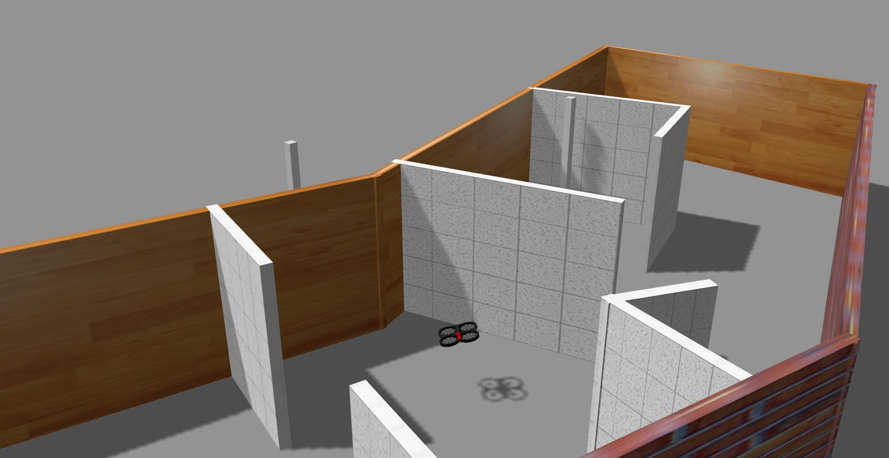
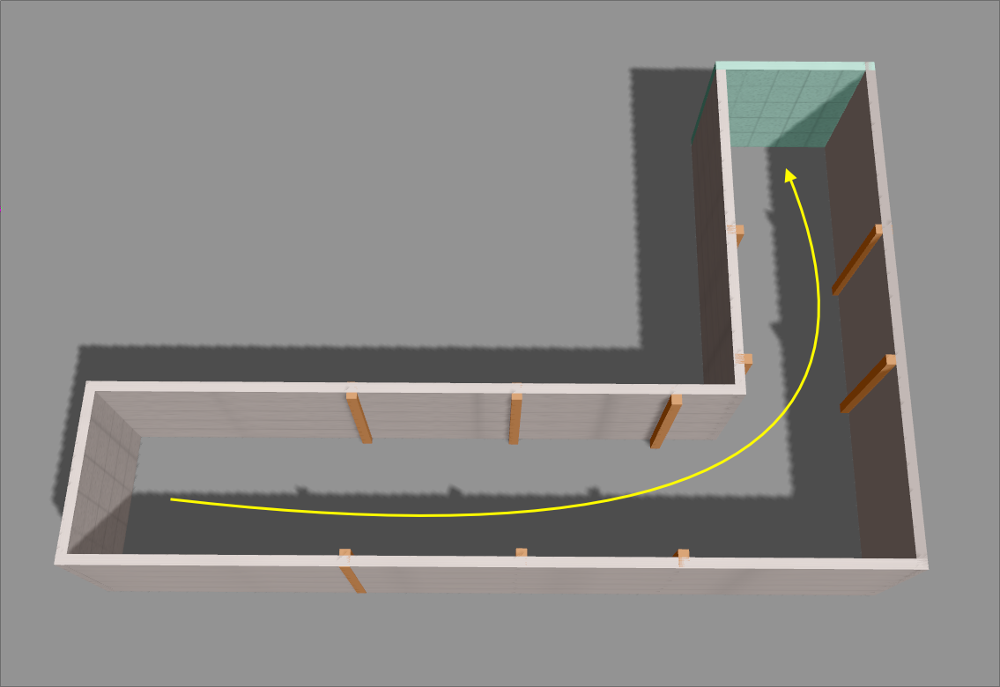
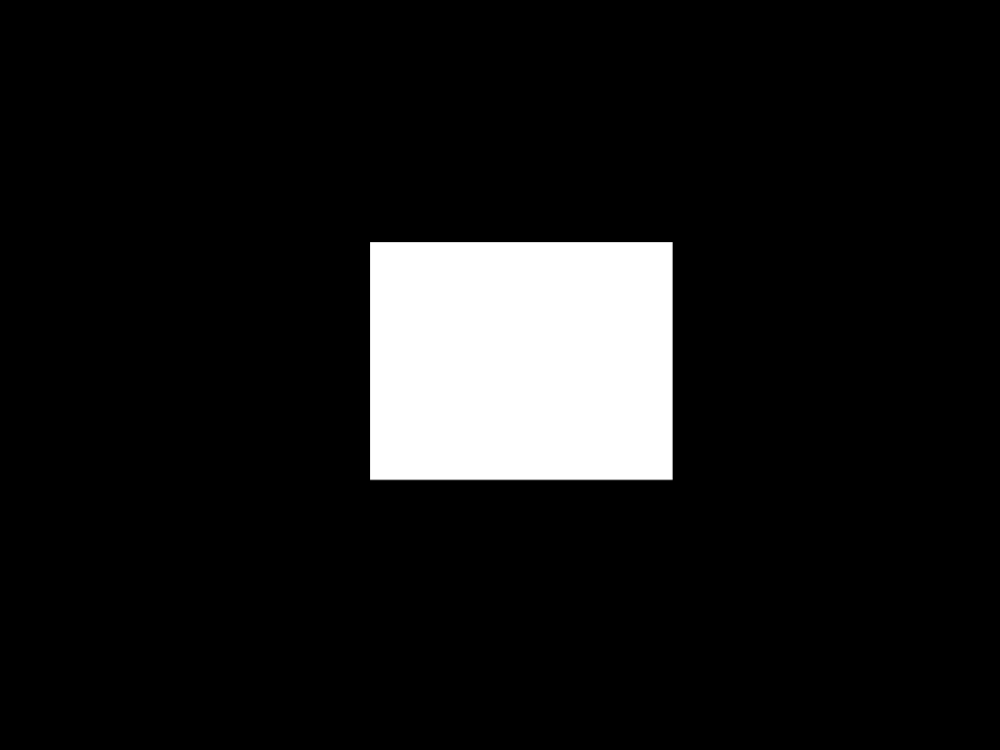
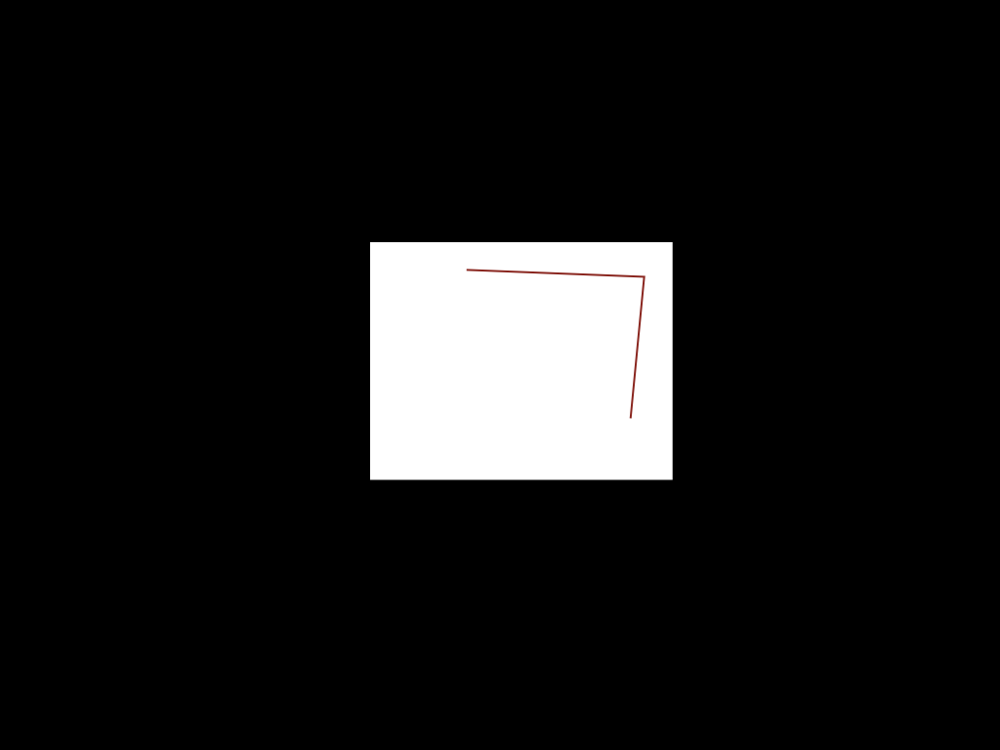
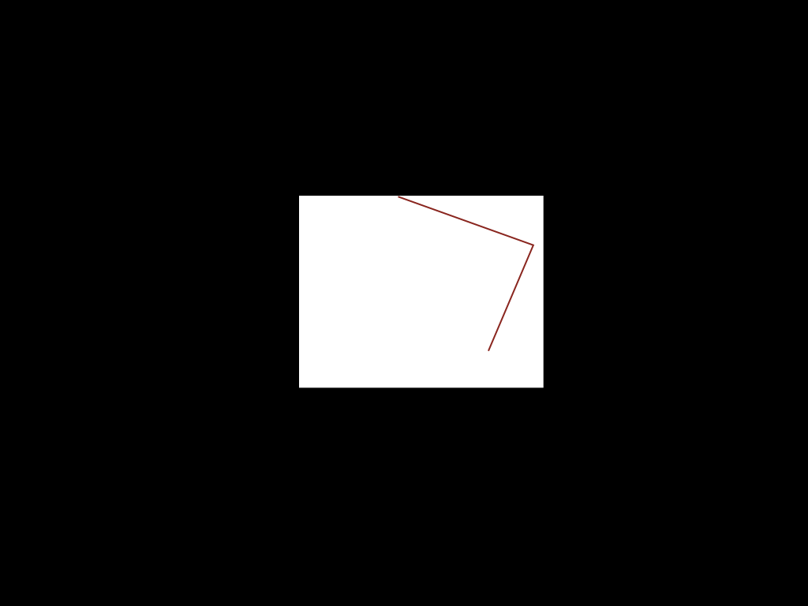

# AR.Drone Navigation

---

### The problem

---

## Why study this problem?

+++

### Planning

+++

### Danger

+++

### The 'uber task'

---

## Current approach

+++

### A3C

+++

### ROS

+++

### Docker

+++

### Bash

---

## Tasks

+++

## Progress from Origin

)

+++

### Move to Goals

)

---

### Architecture

+++

### Goal: build a map

+++

#### Map

)

+++

#### Add vector

)

+++

#### Rotate and translate

)

+++

#### Add vector

)

---

# Demo

---
